# UML-Klassendiagramm: Quantum Dot Studio

```mermaid
classDiagram
    direction TB

    class Material {
        +string Name
        +double BandGap_eV
        +double EffectiveMassElectron
        +double EffectiveMassHole
        +double DielectricConstant
        +double LatticeConstant_A
    }

    class Atom {
        +string Element
        +Vector3 Position
        +double Radius_nm
    }

    class EnergyLevel {
        +int PrincipalQuantumNumber_n
        +int AngularMomentum_l
        +double Energy_eV
        +string Label
    }

    class QuantumDot {
        +Material Material
        +double Radius_nm
        +double ConfinementEnergyElectron_eV
        +double ConfinementEnergyHole_eV
        +double TotalBandGap_eV
        +double EmissionWavelength_nm
        +List~EnergyLevel~ EnergyLevels
        +List~Atom~ Atoms
        +List~...~ ElectronCloud
    }

    class MaterialDatabase {
        +List~Material~ Defaults
    }

    class QuantumSolver {
        +List~EnergyLevel~ SolveSphericalWell(double R, double mStar)
        +double BrusBandGap(Material m, double R)
    }

    class LatticeEngine {
        +List~Atom~ GenerateZincBlende(Material mat, double radius)
        +void FilterInsideSphere(List~Atom~ atoms, double radius)
    }

    class ProbabilityCloudGenerator {
        +List~...~ Generate(EnergyLevel level, double radius)
    }

    class QuantumDotService {
        +QuantumDot BuildQuantumDot(Material mat, double radius)
    }

    class QuantumDotRenderer3D {
        +double AtomScale
        +double CloudPointSize
        +double BoundsPadding_nm
        +Model3DGroup BuildModel(QuantumDot dot, bool showLattice, bool showCloud)
        +Rect3D GetBounds(QuantumDot dot)
    }

    class LatexReportGenerator {
        +string Generate(QuantumDot dot, string? screenshotPath, string title, string author)
    }

    class ScreenshotHelper {
        +bool CaptureViewport(HelixViewport3D viewport, string filePath, int width, int height)
    }

    class RelayCommand {
        +bool CanExecute(object? parameter)
        +void Execute(object? parameter)
        +void RaiseCanExecuteChanged()
    }

    class SimulationViewModel {
        +List~Material~ Materials
        +Material SelectedMaterial
        +double Radius_nm
        +QuantumDot ActiveDot
        +bool ShowLattice
        +bool ShowCloud
        +ICommand RecalculateCommand
        +string? ValidationMessage
    }

    class ExportViewModel {
        +QuantumDot? ActiveDot
        +bool IncludeScreenshot
        +Func~string,string~? ScreenshotProvider
        +string? LastExportPath
        +string? StatusMessage
        +ICommand ExportCommand
        +void ExportLatex()
    }

    class MainViewModel {
        +SimulationViewModel Simulation
        +ExportViewModel Export
    }

    class LegendItem {
        +string Label
        +Brush Color
    }

    MaterialDatabase ..> Material : stellt bereit
    QuantumDot --> Material : verwendet
    QuantumDot --> Atom : enthält
    QuantumDot --> EnergyLevel : enthält
    QuantumDotService --> QuantumSolver : delegiert Energie
    QuantumDotService --> LatticeEngine : generiert Gitter
    QuantumDotService --> ProbabilityCloudGenerator : erzeugt Wolke
    QuantumDotService ..> QuantumDot : erzeugt
    SimulationViewModel --> QuantumDotService : nutzt
    SimulationViewModel --> QuantumDot : hält ActiveDot
    SimulationViewModel --> LegendItem : für Darstellung
    MainViewModel --> SimulationViewModel : hält
    MainViewModel --> ExportViewModel : hält
    ExportViewModel --> QuantumDot : exportiert
    ExportViewModel --> LatexReportGenerator : ruft auf
    MainWindow ..> ScreenshotHelper : CaptureViewport
    MainWindow --> QuantumDotRenderer3D : BuildModel
    SimulationViewModel ..> QuantumDotRenderer3D : steuert Sichtbarkeit
    RelayCommand ..> SimulationViewModel : bindet Commands
```

## Architektur-Erklärung

| Schicht | Klassen | Aufgabe |
|---------|---------|---------|
| **Domain / Core** | `Material`, `Atom`, `EnergyLevel`, `QuantumDot`, `MaterialDatabase` | Reine Datenmodelle mit physikalischer Logik |
| **Services / Solver** | `QuantumDotService`, `QuantumSolver`, `LatticeEngine`, `ProbabilityCloudGenerator` | Berechnungsalgorithmen, unabhängig von UI |
| **Infrastructure** | `QuantumDotRenderer3D` (Helix Toolkit), `LatexReportGenerator` (Reports), `ScreenshotHelper` (WPF) | Technologie-spezifische Ausgaben |
| **Presentation (MVVM)** | `MainViewModel`, `SimulationViewModel`, `ExportViewModel`, `RelayCommand`, `LegendItem` | Vermittlung zwischen UI und Core, Data-Binding |

### Wichtige Designentscheidungen

- **Material ist immutable**: Alle Parameter werden per Konfiguration geladen und sind zur Laufzeit konstant.
- **QuantumSolver ist zustandslos**: Eingabe (R, m*) -> Ausgabe (Energieliste). Ermöglicht Unit-Testing und Wiederverwendung.
- **LatticeEngine trennt Erzeugung von Filterung**: Zuerst wird das Gitter erzeugt, dann auf die Kugel beschnitten. Das erleichtert spätere Erweiterung auf andere Formen.
- **QuantumDotService orchestriert die Berechnung**: Kombiniert Solver, Gitter und Wahrscheinlichkeitswolke in einem einzigen `QuantumDot`.
- **LatexReportGenerator ist entkoppelt**: `.tex`-Generierung ist vollständig von der Berechnung getrennt.
- **ScreenshotHelper liegt in der WPF-Schicht**: Rendering-Logik bleibt View-spezifisch; das ViewModel entscheidet nur über Dateinamen/Pfad.
