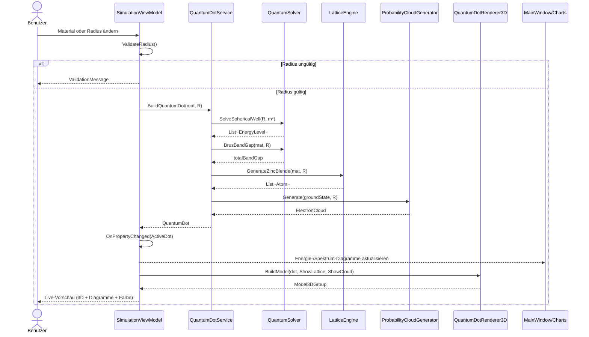
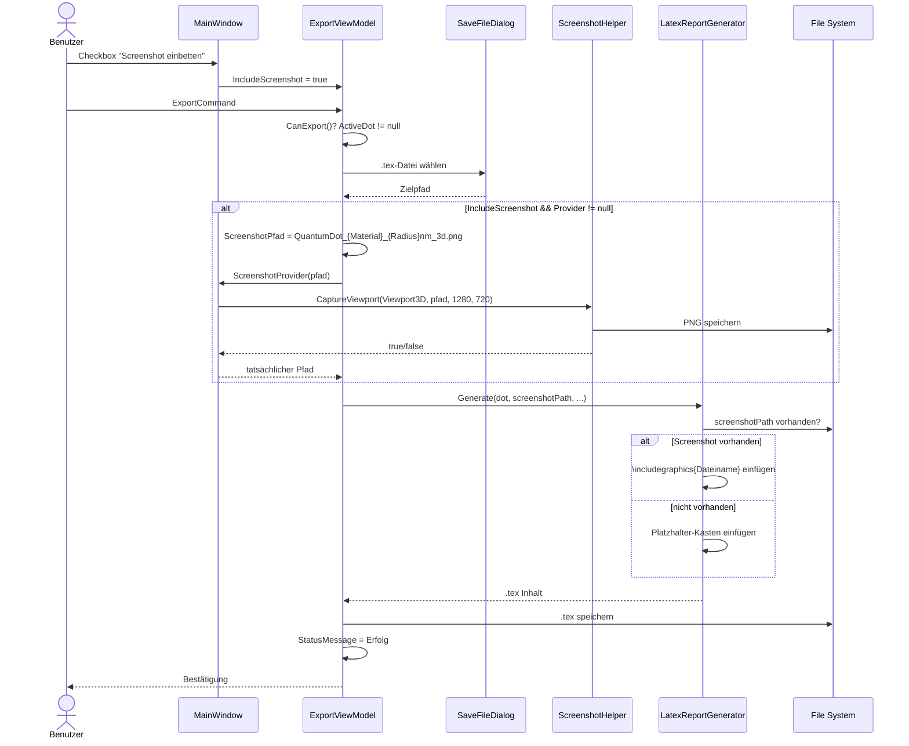

# UML-Sequenzdiagramme: Quantum Dot Studio

## 1. Radius-Änderung (Live-Vorschau)

## 2. LaTeX-Export mit 3D-Screenshot

## Beschreibung der Interaktionen

### Radius-Änderung
1. **Trigger**: Benutzer ändert Material oder Radius in der WPF-UI.
2. **Validierung**: `SimulationViewModel` prüft, ob der Radius im gültigen Bereich liegt.
3. **Berechnung**: `QuantumDotService` ruft `QuantumSolver` für Energieniveaus und Brus-Bandlücke, `LatticeEngine` für das Gitter und `ProbabilityCloudGenerator` für die Wahrscheinlichkeitswolke.
4. **Visualisierung**: `QuantumDotRenderer3D` zeichnet Atome und Wahrscheinlichkeitswolke neu. OxyPlot-Diagramme aktualisieren sich über Data-Binding.
5. **Feedback**: Benutzer sieht 3D-Struktur, Energiediagramm und Emissionsspektrum in Echtzeit.

### LaTeX-Export
1. **Trigger**: Benutzer aktiviert optional die Screenshot-Checkbox und klickt auf Export.
2. **Dateiauswahl**: `ExportViewModel` öffnet einen `SaveFileDialog` für `.tex`.
3. **Screenshot (optional)**: Wenn aktiviert, ruft das ViewModel den registrierten `ScreenshotProvider` in `MainWindow` auf, der `ScreenshotHelper.CaptureViewport()` verwendet.
4. **Berichtsgenerierung**: `LatexReportGenerator.Generate()` erzeugt den LaTeX-Quelltext und bindet das Bild mit relativem Dateinamen ein oder fällt auf den Platzhalter zurück.
5. **Speichern**: `.tex`-Datei wird geschrieben und eine Statusmeldung angezeigt.
