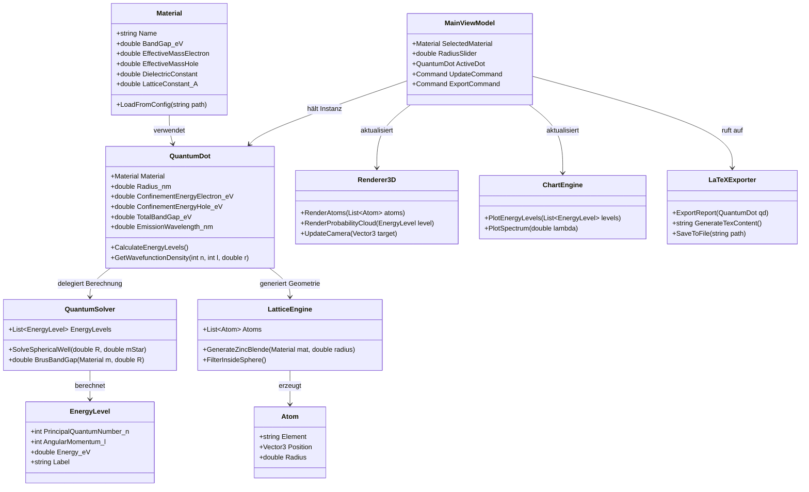

# UML-Klassendiagramm: Quantum Dot Studio

## Architektur-Erklärung

| Schicht | Klassen | Aufgabe |
|---------|---------|---------|
| Domain | Material, QuantumDot, EnergyLevel, Atom | Reine Datenmodelle mit physikalischer Logik |
| Core/Services | QuantumSolver, LatticeEngine | Berechnungsalgorithmen, unabhängig von UI |
| Infrastructure | Renderer3D (Helix Toolkit), ChartEngine (OxyPlot), LaTeXExporter | Technologie-spezifische Ausgaben |
| Presentation (MVVM) | MainViewModel | Vermittlung zwischen UI und Core, Data-Binding |
