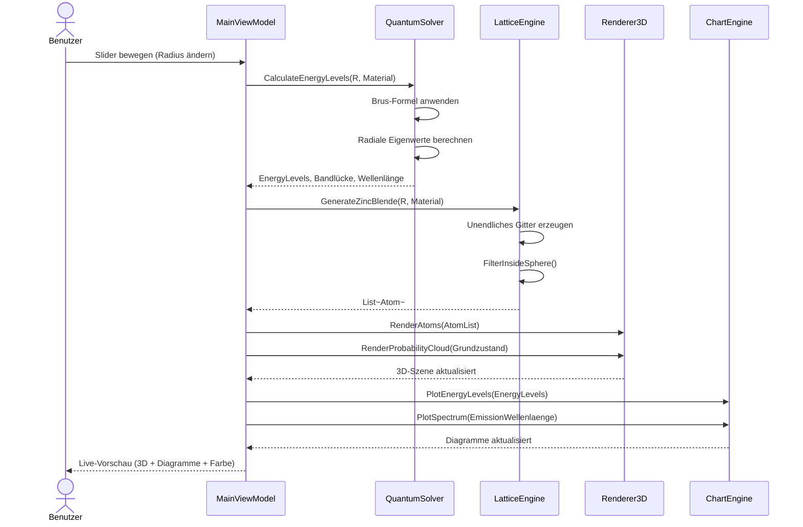

# UML-Sequenzdiagramm: Radius-Änderung

## Beschreibung der Interaktion

1. **Trigger**: Benutzer bewegt den Radius-Slider.
2. **Berechnung**: QuantumSolver berechnet Energieniveaus (Brus-Korrektur) und Emissionswellenlänge.
3. **Geometrie**: LatticeEngine generiert neues sphärisches Gitterstück.
4. **Visualisierung**: Renderer3D zeichnet Atome und Wahrscheinlichkeitswolke neu. ChartEngine aktualisiert Energiediagramm und Spektrum.
5. **Feedback**: Benutzer sieht alle drei Darstellungen in Echtzeit.
